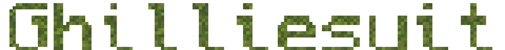
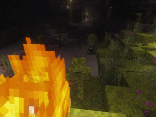
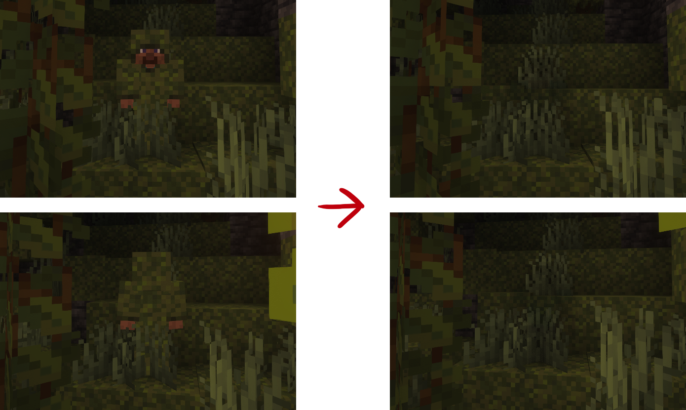
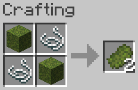
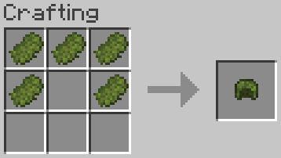
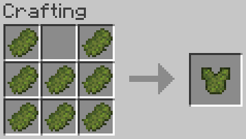
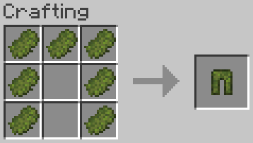
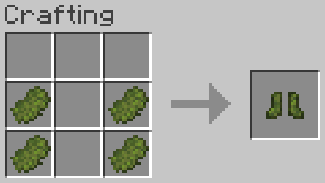

  

  
  
  

This Minecraft mod adds a mossy ghillie suit, that helps you hide from mobs and players.

  

  
  

  

## How it works

The ghillie suit has two stealth tiers.

Each piece you wear makes it harder for mobs to see you. With the full suit, the mob detection range is cut in half.

When you wear the full suit and crouch, you become invisible to all mobs. They can no longer target you, and mobs that are already chasing you will lose you. Other players still see you as a translucent ghost, so you blend in instead of vanishing.

  

## How to get started

Craft your moss weave first. Then craft the ghillie suit armour pieces from it.

Moss Weave is made from 2 moss blocks and 2 string.

  

Each armour piece is made from moss weave in the normal armour shapes.

  
  
  
  

The suit is repairable with moss weave.

## Modpacks and credits

You can use this mod in a modpack. Just link back to this page as the original mod.

I originally made this mod to teach myself how to mod with Fabric. Feel free to take it apart and reference it for your own mod.

The mod is only distributed from this GitHub page and the Modrinth page linked at the top.

The mod started from the [Fabric example mod](https://github.com/FabricMC/fabric-example-mod).

## License

CC0. You can copy it, change it, and use it however you like. See [LICENSE](LICENSE).
